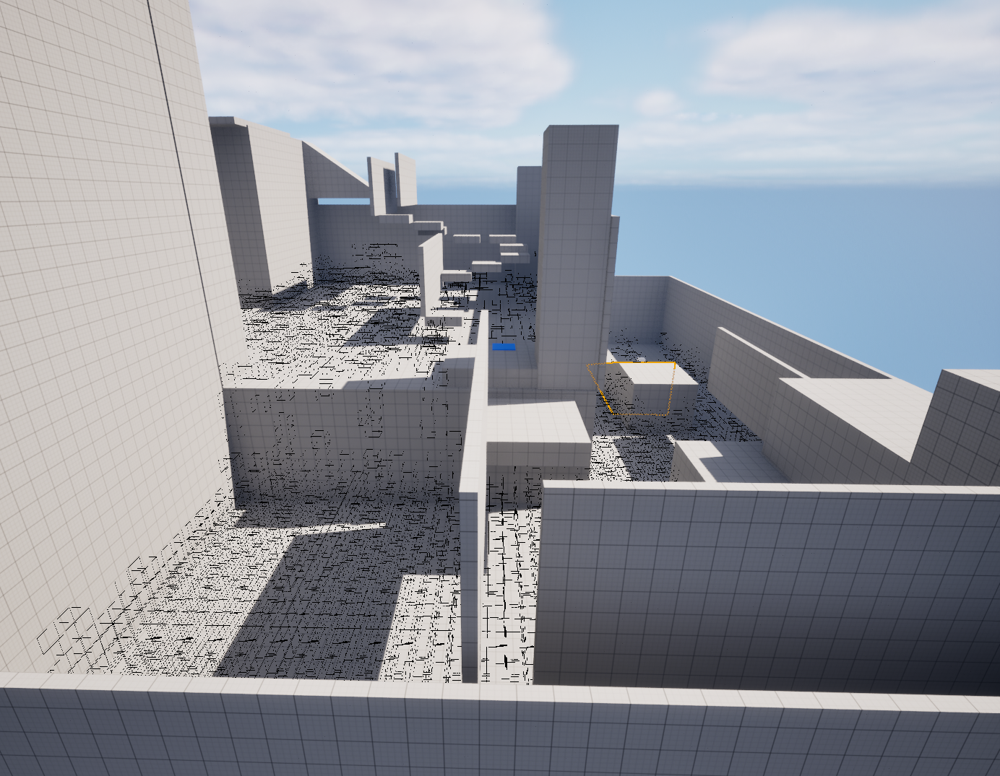

<!DOCTYPE html>
<hmtl lang="en">
<body style="background-color:midnightblue;">

<h1 style="color: crimson;">
    Go-Explore in Unreal Engine 5
</h1>
    

 
    Explore is a machine playtesting plugin to help developers and students test for level designs or character movement bugs in Unreal Engine 5

<!-- Not really sure what else to put on my website so far???-->
<h2 style="color: white;">Showcase Image</h2>

Example showcase of the algorithm running through an example level

</hmtl>
